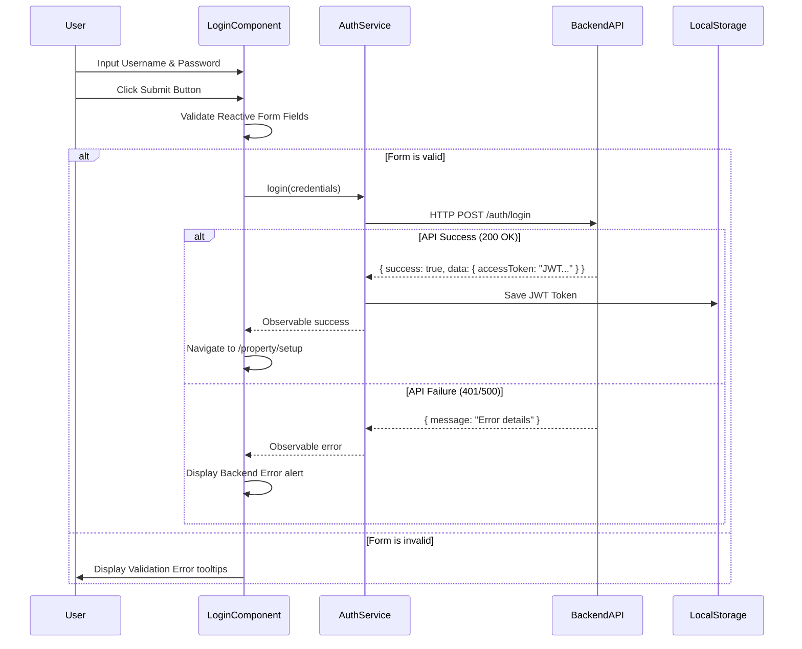
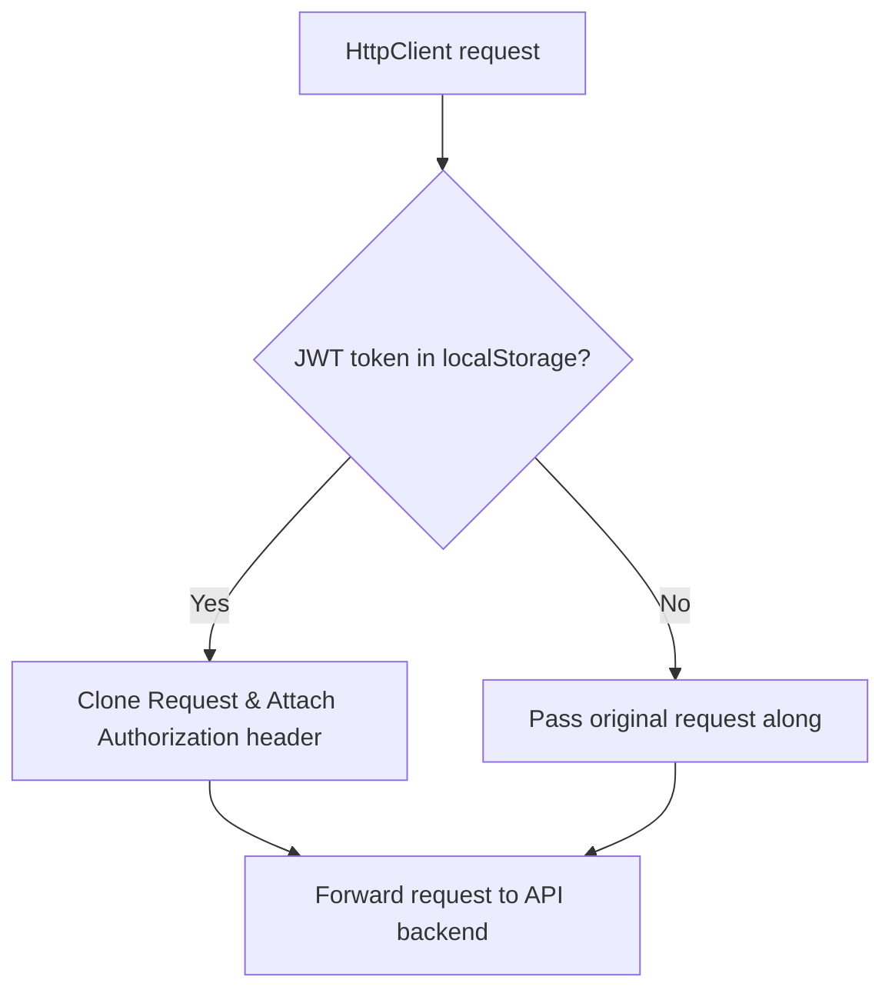

# TENANCY - Authentication Setup & Architecture

This document describes the implementation of the JWT-based Authentication module for the **TENANCY** ERP application.

---

## 1. Directory & Folder Structure

All newly created and modified files adhere to the existing Angular standalone project structure:

```
src/
├── app/
│   ├── interceptors/
│   │   └── auth.interceptor.ts         <-- NEW: Intercepts HTTP requests to add JWT token headers
│   ├── models/
│   │   └── login.model.ts              <-- NEW: TypeScript interfaces for Login payload and response
│   ├── services/
│   │   └── auth.service.ts             <-- NEW: Auth endpoints communications and token cache management
│   ├── demo/
│   │   └── pages/
│   │       └── authentication/
│   │           └── auth-login/
│   │               ├── auth-login.component.ts   <-- MODIFIED: Bind Reactive Forms, validation, submit routing
│   │               ├── auth-login.component.html <-- MODIFIED: Modern Login form UI, circular avatar, logo, error alerts
│   │               └── auth-login.component.scss <-- MODIFIED: Visual style rules for layout spacing
│   ├── app-routing.module.ts           <-- MODIFIED: Default route redirection configuration
│   └── theme/
│       └── layouts/
│           └── admin-layout/
│               └── navigation/
│                   ├── navigation.component.html <-- MODIFIED: Updated top-left sidebar header spelling
│                   └── navigation.ts             <-- MODIFIED: Updated navigation group branding spelling
├── index.html                          <-- MODIFIED: Global browser window document title branding
└── main.ts                             <-- MODIFIED: App bootstrap providers registration (provideHttpClient + Interceptor)
```

---

## 2. File Directory List & Detailed Purpose

### Files Created

1. **[login.model.ts](file:///c:/Users/hp/Downloads/Setup-Property-1e3cd1d77bfb4dd0155593cd140a7ee89dd71ef8%20%281%29/Setup-Property-1e3cd1d77bfb4dd0155593cd140a7ee89dd71ef8/src/app/models/login.model.ts)**
   * **Purpose**: Declares TypeScript interfaces (`LoginRequest` and `LoginResponse`) to enforce strict type checking on API request parameters and JSON responses.
2. **[auth.service.ts](file:///c:/Users/hp/Downloads/Setup-Property-1e3cd1d77bfb4dd0155593cd140a7ee89dd71ef8%20%281%29/Setup-Property-1e3cd1d77bfb4dd0155593cd140a7ee89dd71ef8/src/app/services/auth.service.ts)**
   * **Purpose**: Coordinates authentication actions. Transmits login payloads to the API server and caches/manages the JWT token inside browser `localStorage`.
3. **[auth.interceptor.ts](file:///c:/Users/hp/Downloads/Setup-Property-1e3cd1d77bfb4dd0155593cd140a7ee89dd71ef8%20%281%29/Setup-Property-1e3cd1d77bfb4dd0155593cd140a7ee89dd71ef8/src/app/interceptors/auth.interceptor.ts)**
   * **Purpose**: Functional Angular HTTP interceptor. Intercepts all outgoing HTTP calls to dynamically append the `Authorization: Bearer <token>` header if a token is stored.

### Files Modified

1. **[main.ts](file:///c:/Users/hp/Downloads/Setup-Property-1e3cd1d77bfb4dd0155593cd140a7ee89dd71ef8%20%281%29/Setup-Property-1e3cd1d77bfb4dd0155593cd140a7ee89dd71ef8/src/main.ts)**
   * **Purpose**: Registered the standalone `provideHttpClient()` client and associated `authInterceptor` inside the bootstrap application providers array.
2. **[app-routing.module.ts](file:///c:/Users/hp/Downloads/Setup-Property-1e3cd1d77bfb4dd0155593cd140a7ee89dd71ef8%20%281%29/Setup-Property-1e3cd1d77bfb4dd0155593cd140a7ee89dd71ef8/src/app/app-routing.module.ts)**
   * **Purpose**: Updated root redirect route path from `/dashboard/default` to `/login` so that unauthenticated entries land directly on the login page.
3. **[auth-login.component.ts](file:///c:/Users/hp/Downloads/Setup-Property-1e3cd1d77bfb4dd0155593cd140a7ee89dd71ef8%20%281%29/Setup-Property-1e3cd1d77bfb4dd0155593cd140a7ee89dd71ef8/src/app/demo/pages/authentication/auth-login/auth-login.component.ts)**
   * **Purpose**: Configures Reactive Forms structure, inputs validation checks, onSubmit handler connection to `AuthService`, loading indicators, and error reporting.
4. **[auth-login.component.html](file:///c:/Users/hp/Downloads/Setup-Property-1e3cd1d77bfb4dd0155593cd140a7ee89dd71ef8%20%281%29/Setup-Property-1e3cd1d77bfb4dd0155593cd140a7ee89dd71ef8/src/app/demo/pages/authentication/auth-login/auth-login.component.html)**
   * **Purpose**: Redesigned modern login card form: added circular profile avatar icon, integrated error alerts, removed register/social buttons, and renamed branding to TENANCY.
5. **[auth-login.component.scss](file:///c:/Users/hp/Downloads/Setup-Property-1e3cd1d77bfb4dd0155593cd140a7ee89dd71ef8%20%281%29/Setup-Property-1e3cd1d77bfb4dd0155593cd140a7ee89dd71ef8/src/app/demo/pages/authentication/auth-login/auth-login.component.scss)**
   * **Purpose**: Cleared the large background overlay image and configured a premium linear gradient.
6. **[index.html](file:///c:/Users/hp/Downloads/Setup-Property-1e3cd1d77bfb4dd0155593cd140a7ee89dd71ef8%20%281%29/Setup-Property-1e3cd1d77bfb4dd0155593cd140a7ee89dd71ef8/src/index.html)**
   * **Purpose**: Changed global browser window document title and meta titles to **TENANCY**.
7. **[navigation.component.html](file:///c:/Users/hp/Downloads/Setup-Property-1e3cd1d77bfb4dd0155593cd140a7ee89dd71ef8%20%281%29/Setup-Property-1e3cd1d77bfb4dd0155593cd140a7ee89dd71ef8/src/app/theme/layouts/admin-layout/navigation/navigation.component.html)**
   * **Purpose**: Changed sidebar top-left header logo text branding to **TENANCY**.
8. **[navigation.ts](file:///c:/Users/hp/Downloads/Setup-Property-1e3cd1d77bfb4dd0155593cd140a7ee89dd71ef8%20%281%29/Setup-Property-1e3cd1d77bfb4dd0155593cd140a7ee89dd71ef8/src/app/theme/layouts/admin-layout/navigation/navigation.ts)**
   * **Purpose**: Changed navigation metadata root category label to **TENANCY**.

---

## 3. Architecture & Authentication Flow

### A. Login Process


### B. Request Interceptor Pipeline


---

## 4. How to Add Future Authentication APIs

If you need to extend the authentication capabilities later (e.g. Refresh Token, Reset Password, or Profile details), follow this pattern:

### Step 1: Update Model
Add the request/response payloads in `src/app/models/login.model.ts`:
```typescript
export interface ForgotPasswordRequest {
  email: string;
}
```

### Step 2: Implement Method in `AuthService`
Add the corresponding HTTP endpoint connection method in `src/app/services/auth.service.ts`:
```typescript
forgotPassword(payload: ForgotPasswordRequest): Observable<any> {
  const url = `${environment.apiUrl}/ty/auth/forgot-password`;
  return this.http.post<any>(url, payload);
}
```

### Step 3: Connect inside Page Component
Inject `AuthService` and invoke the method:
```typescript
this.authService.forgotPassword({ email: 'user@tenancy.com' }).subscribe({
  next: (response) => alert('Recovery email sent!'),
  error: (err) => this.errorMessage = err.message
});
```

---

## 5. Configuration Changes Required

No structural configurations are required. Ensure that:
1. `environment.apiUrl` in `src/environments/environment.ts` matches your running API server host (currently configured to `https://tenancyapi.siddev.online/api`).
2. The browser supports `localStorage` caching.
